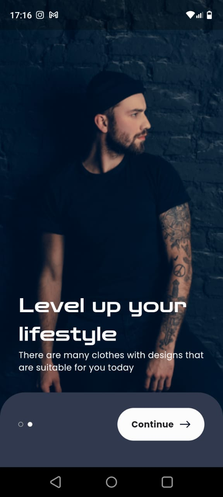
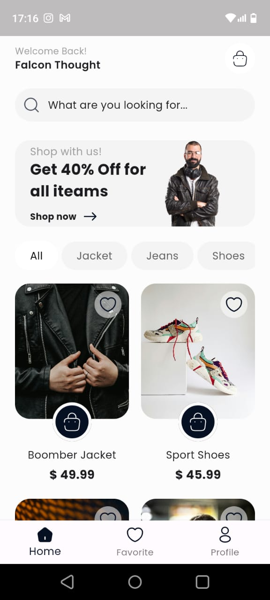
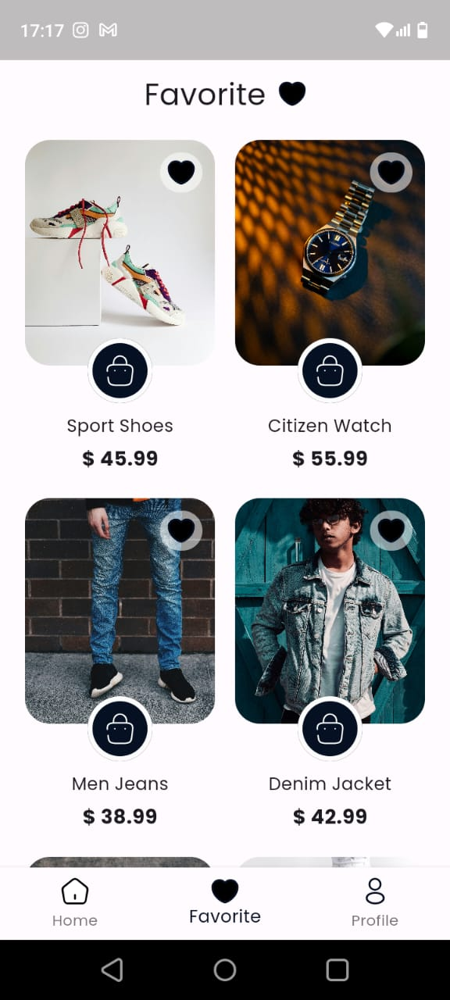
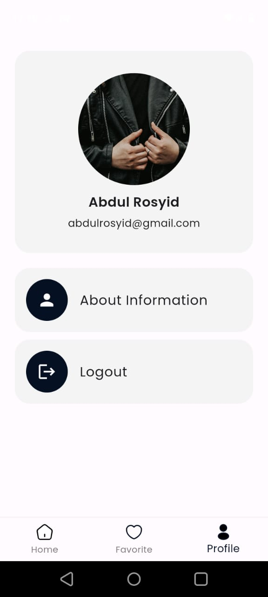
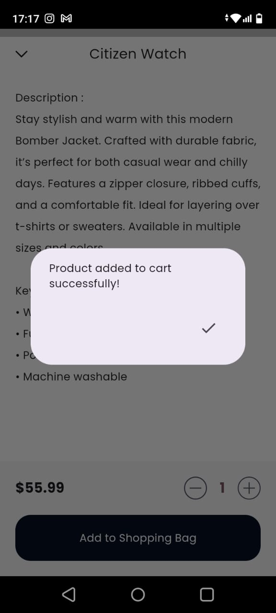
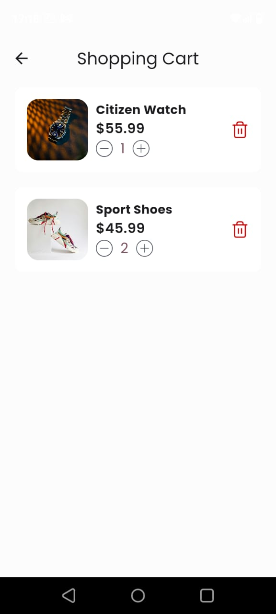
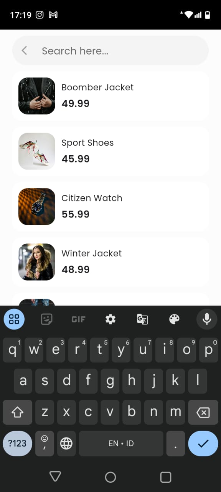
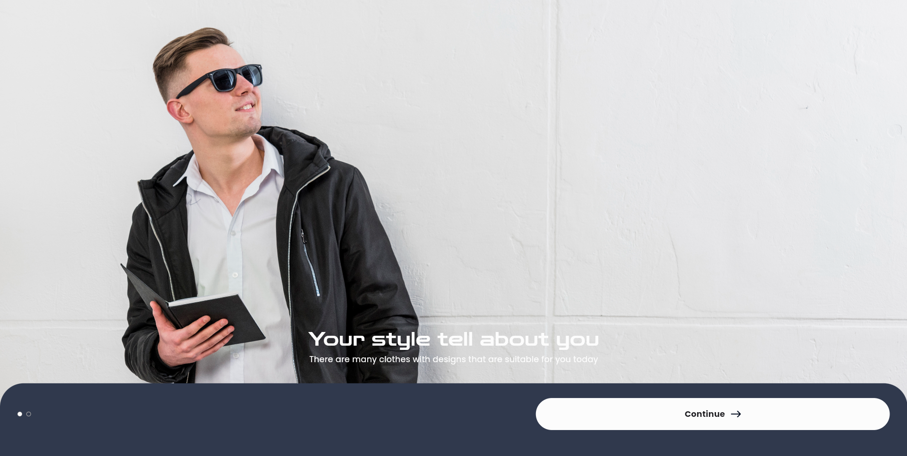
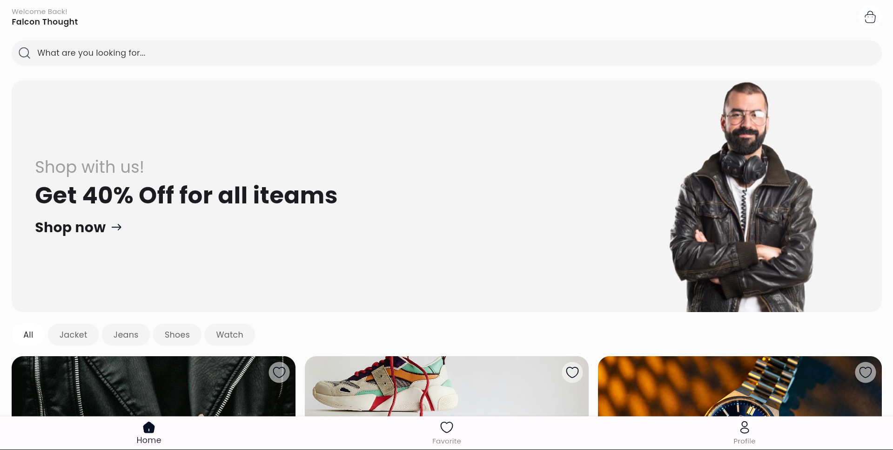
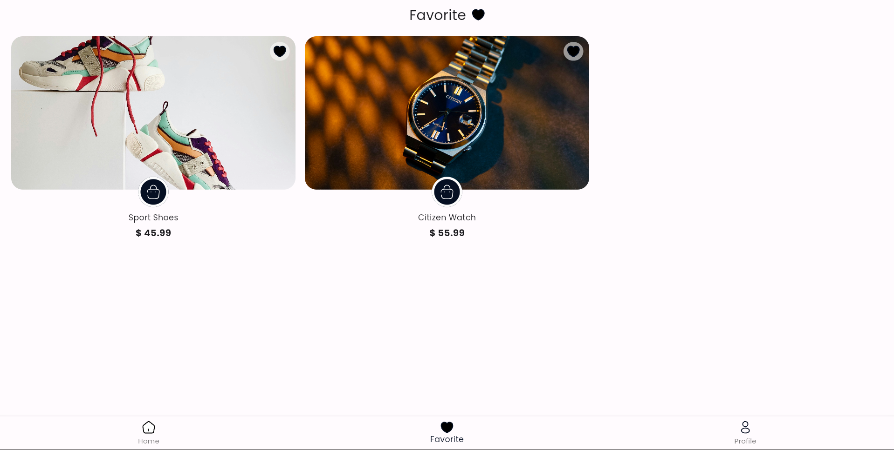

# project-idcamp-flutter

## Thaks to designer
### https://www.figma.com/community/file/1176201382698798174/e-commerce-clothing-app

## Images result for mobile app

## Images result for dekstop website

